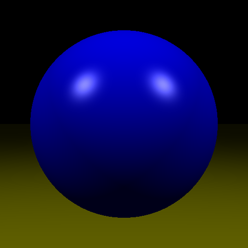

# physicsEngine

A minimal educational ray casting / shading sandbox in Rust. Renders a single Phong-lit sphere to both a window (via `winit` + `pixels`) and a saved PNG (`render.png`). Useful as a starter for learning:

- Screen-to-ray generation (pinhole camera)
- Ray vs sphere intersection
- Surface normal computation
- Basic Phong illumination (ambient + diffuse + specular)
- CPU raster loop -> GPU blit (using `pixels`)
- Saving raw RGBA buffer to disk (using `image` crate)

## Current Features
- Single sphere primitive
- Point light with Phong shading
- Blue material (customizable in `camera.rs`)
- Specular highlight (adjust shininess for gloss)
- Image export on startup (`render.png`)
- Continuous or single-frame render structure (currently single-frame)

## Render Preview
The image produced on launch (example):



> If the highlight looks misplaced, ensure FOV is treated as degrees and converted to radians (already fixed) and that view & light vectors use point->camera / point->light directions.

## Coordinate System
- Right-handed
- Camera looks down +Z
- +Y is up (after vertical flip when mapping pixels)
- Normal = (hit_point - sphere_center).normalized()

## Project Structure
```
src/
  main.rs        # App + window lifecycle
  camera.rs      # Ray generation + shading loop
  sphere.rs      # Sphere primitive + intersection
  ray.rs         # Ray struct
  phong.rs       # Phong shading function
  light.rs       # Point light
  color.rs       # Color math & clamping
  vec3.rs        # 3D vector math
render.png       # Output image (overwritten on each run)
```

## Build & Run
Prerequisites: Rust (stable toolchain)

```bash
cargo run
```
This will:
1. Open a 500x500 window displaying the rendered sphere.
2. Write `render.png` into the project root.

Run tests:
```bash
cargo test
```

## Adjusting the Scene
Edit in `main.rs`:
- Sphere radius / position
- Light position / color
- Camera FOV & resolution

Shading tweaks in `camera.rs` (material colors, shininess).

## Extending Ideas
- Multiple spheres (store a Vec<Sphere>)
- Shadows (shoot shadow ray toward light)
- Reflections (recursive rays)
- Simple BVH for acceleration
- Gamma correction before writing pixels

## Known Simplifications
- No anti-aliasing
- No tone mapping / gamma pass
- No acceleration structure
- Single light source

## License
Add a license of your choice (e.g. MIT/Apache-2.0) if you plan to publish.

---
Minimal, clear, and hackable—ideal as a base for further ray tracing experiments.

